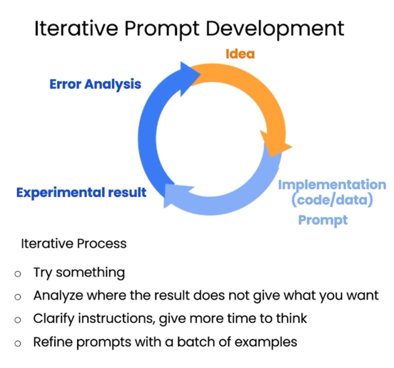

= AI Prompt Engineering

https://learn.deeplearning.ai/chatgpt-prompt-eng[source]

== Principle 1
Write clear and specific instructions

.Tactic 1: Use delimiters
----
* Triple quotes: "'"
* Triple backticks:'"
* Triple dashes: -
* Angle brackets: ‹ ›
* XML tags: ‹tag› ‹/tag>
----

.Tactic 2: Ask for structured output
----
HTML, JSON
----

.Tactic 3: Check whether conditions are satisfied
Check assumptions required to do the task

.Tactic 4: Few-shot prompting
Give successful examples of completing tasks
Then ask model to perform the task

== Principle 2
Give the model time to think

.Tactic 1: Specify the steps to complete a task
----
Step 1: ...
Step 2: ...
Step N: ...
----

.Tactic 2:
Instruct the model to work out its own solution before rushing to a conclusion

== Iterative Prompt Development

== Summarizing

* Try "extract" instead of "summarize"
* Set a limit of words or sentences
* Ask to focus on a detail

== Inferring

.Sentiment (positive/negative)
----
What is the sentiment of the following product review,
which is delimited with triple backticks?

Review text: '''{review}'''
----

.Identify types of emotions
----
Identify a list of emotions that the writer of the \
following review is expressing. Include no more than \
five items in the list. Format your answer as a list of \
lower-case words separated by commas.

Review text: '''{review}'''
----

.Identify anger
----
Is the writer of the following review expressing anger?\
The review is delimited with triple backticks. \
Give your answer as either yes or no.

Review text: '''{review}'''
----

.Extract product and company name from customer reviews
----
Is the writer of the following review expressing anger?\
The review is delimited with triple backticks. \
Give your answer as either yes or no.

Review text: '''{review}'''
----

.Doing multiple tasks at once
----
Identify the following items from the review text:
- Item purchased by reviewer
- Company that made the item

The review is delimited with triple backticks. \
Format your response as a JSON object with \
"Item" and "Brand" as the keys.
If the information isn't present, use "unknown" \
as the value.
Make your response as short as possible.

Review text: '''{review}'''
----

.Infer topics
----
Determine five topics that are being discussed in the \
following text, which is delimited by triple backticks.

Make each item one or two words long.

Format your response as a list of items separated by commas.

Text sample: '''{story}'''
----

.Make a news alert for certain topics
----
Determine whether each item in the following list of \
topics is a topic in the text below, which
is delimited with triple backticks.

Give your answer as list with 0 or 1 for each topic.\

List of topics: {"topic1", "topic2"}

Text sample: '''{story}'''
"""
----

== Transforming
* Language translation,
* Guessing the language,
* Spelling and grammar checking (ex: Proofread and correct the following...)
* Tone adjustment (ex : from slang to a business letter),
* Format conversion (ex: from JSON to an HTML)

== Expanding
We can modify the temperature (0 \<= t \<= 1) to have more "creative" output.
[source, python]
.python example
----
messages = [{"role": "user", "content": prompt}]
response = openai.ChatCompletion.create(
    "gpt-3.5-turbo",
    messages,
    0, # this is the degree of randomness of the model's output (0-1)
)
result = response.choices[0].message["content"]
----

== Chatbot
It's possible to create a conversational chatbot such as ChatGPT using the OpenAI API since it allows passing JSON formatted messages as follows :
----
[{"role": "system", "content": "system context"}, {"role": "user", "content": "my prompt"},]
----
* "_system_" role allows setting the context
* Other roles are the conversation participants, for instance "_user_" and "_assistant_"
* for each call to the API, we pass the entire conversation back to keep the context up to date. (to the _openai.ChatCompletion.create()_ for instance)

[source, python]
.example
----
messages =  [
{'role':'system', 'content':'You are an assistant that speaks like Shakespeare.'},
{'role':'user', 'content':'tell me a joke'},
{'role':'assistant', 'content':'Why did the chicken cross the road'},
{'role':'user', 'content':'I don\'t know'}  ]
----